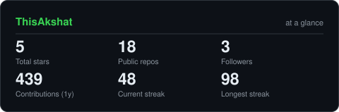
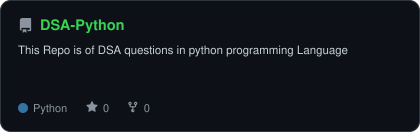
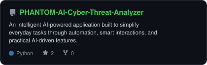
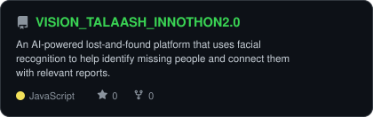

<div align="center">


<br>

<a href="https://github.com/ThisAkshat">
  
</a>

<br>

<a href="https://linkedin.com/in/akshat132005"></a>
<a href="mailto:akshatsharma1313@gmail.com"></a>
<a href="https://leetcode.com/u/Akshat_13IS/"></a>
<a href="https://instagram.com/the__akshatsharma"></a>
<a href="https://x.com/AkshatShar64224"></a>
<a href="https://youtube.com/@AK_IS13"></a>


</div>

---

## `~/` whoami

```console
$ cat about.txt
```

Hi, I'm **Akshat Sharma**. I build things at the intersection of artificial intelligence,
machine learning, backend engineering, and real-world problem solving.

- Currently building **AI/ML applications with Python**
- Built **DSA-Python, PHANTOM-AI-Cyber-Threat-Analyzer, VISION_TALAASH_INNOTHON2.0**
- Working with **NLP, Computer Vision, Deep Learning and Data Analysis**
- Solved **220+ LeetCode problems**
- Learning **Cloud Deployment, Distributed Systems and MLOps**
- Fun fact: **I enjoy turning ideas into systems that actually work.**

<br>

<div align="center">

## `~/` toolbox


</div>

---

<div align="center">

## `~/` skill radar

<table>
<tr>
<td width="50%" align="center" valign="middle">
<picture>
  <source media="(prefers-color-scheme: dark)"  srcset="assets/radar-dark.svg">
  <source media="(prefers-color-scheme: light)" srcset="assets/radar-light.svg">
  
</picture>
</td>
<td width="50%" align="center" valign="middle">
<picture>
  <source media="(prefers-color-scheme: dark)"  srcset="assets/radar-langs-dark.svg">
  <source media="(prefers-color-scheme: light)" srcset="assets/radar-langs-light.svg">
  
</picture>
</td>
</tr>
</table>

</div>

---

<div align="center">

## `~/` contribution calendar


<br><br>

<picture>
  <source media="(prefers-color-scheme: dark)"  srcset="https://raw.githubusercontent.com/ThisAkshat/ThisAkshat/output/github-snake-red.svg">
  <source media="(prefers-color-scheme: light)" srcset="https://raw.githubusercontent.com/ThisAkshat/ThisAkshat/output/github-snake-red.svg">
  
</picture>

</div>

---

<div align="center">

## `~/` the numbers

<picture>
  <source media="(prefers-color-scheme: dark)"  srcset="assets/card-stats-dark.svg">
  <source media="(prefers-color-scheme: light)" srcset="assets/card-stats-light.svg">
  
</picture>

<br>


<br><br>


</div>

---

<div align="center">

## `~/` selected work

<table>
<tr>
<td width="50%">
  <a href="https://github.com/ThisAkshat/DSA-Python">
    <picture>
      <source media="(prefers-color-scheme: dark)"  srcset="assets/card-DSA-Python-dark.svg">
      <source media="(prefers-color-scheme: light)" srcset="assets/card-DSA-Python-light.svg">
      
    </picture>
  </a>
</td>
<td width="50%">
  <a href="https://github.com/ThisAkshat/PHANTOM-AI-Cyber-Threat-Analyzer">
    <picture>
      <source media="(prefers-color-scheme: dark)"  srcset="assets/card-PHANTOM-AI-Cyber-Threat-Analyzer-dark.svg">
      <source media="(prefers-color-scheme: light)" srcset="assets/card-PHANTOM-AI-Cyber-Threat-Analyzer-light.svg">
      
    </picture>
  </a>
</td>
</tr>
<tr>
<td width="50%">
  <a href="https://github.com/ThisAkshat/VISION_TALAASH_INNOTHON2.0">
    <picture>
      <source media="(prefers-color-scheme: dark)"  srcset="assets/card-VISION_TALAASH_INNOTHON2.0-dark.svg">
      <source media="(prefers-color-scheme: light)" srcset="assets/card-VISION_TALAASH_INNOTHON2.0-light.svg">
      
    </picture>
  </a>
</td>
<td width="50%"></td>
</tr>
</table>

<sub>

| project | description |
|---|---|
| **[DSA-Python](https://github.com/ThisAkshat/DSA-Python)** | Data Structures & Algorithms practice in Python |
| **[PHANTOM-AI-Cyber-Threat-Analyzer](https://github.com/ThisAkshat/PHANTOM-AI-Cyber-Threat-Analyzer)** | AI-powered cyber threat detection and analysis tool |
| **[VISION_TALAASH_INNOTHON2.0](https://github.com/ThisAkshat/VISION_TALAASH_INNOTHON2.0)** | AI-powered lost-and-found platform using facial recognition |

</sub>

</div>

---

<div align="center">
<sub>`01110100 01101000 01100001 01101110 01101011 01110011 00100000 01100110 01101111 01110010 00100000 01110011 01100011 01110010 01101111 01101100 01101100 01101001 01101110 01100111`</sub>
</div>
